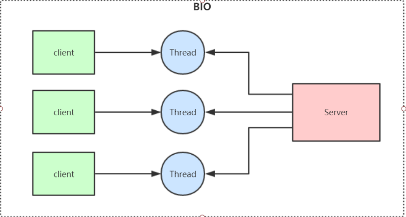
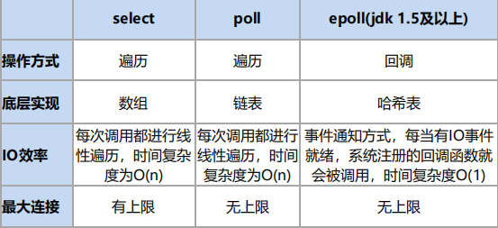
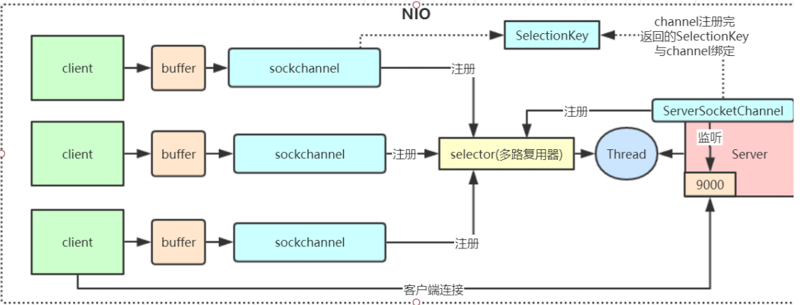

# 一、BIO（Blocking IO）

## 1、特点

同步阻塞模型，一个线程只能处理一个请求

## 2、缺点

- IO代码里read操作是阻塞操作，如果连接不做数据读写操作会导致线程阻塞，浪费资源

- 如果线程很多，会导致服务器线程太多，压力太大

## 3、应用场景

BIO适用于请求数量较小且固定的架构



## 4、代码演示

```java

```


# 二、NIO（Non Blocking IO）

## 1、特点

同步非阻塞，服务器实现模式为一个线程可以处理多个请求，客户端发送的连接请求都会注册到多路复用器epoll上，多路复用器轮询到有请求的就执行处理；I/O多路复用一般用Linux API（select、poll、epoll）来实现。区别：



## 2、三大组件

- Channel（通道）
- Buffer（缓冲区）
- Selector（选择器）

## 3、使用场景

一般使用在连接数多并且比较短的架构，比如聊天系统、弹幕系统、服务器间通讯

