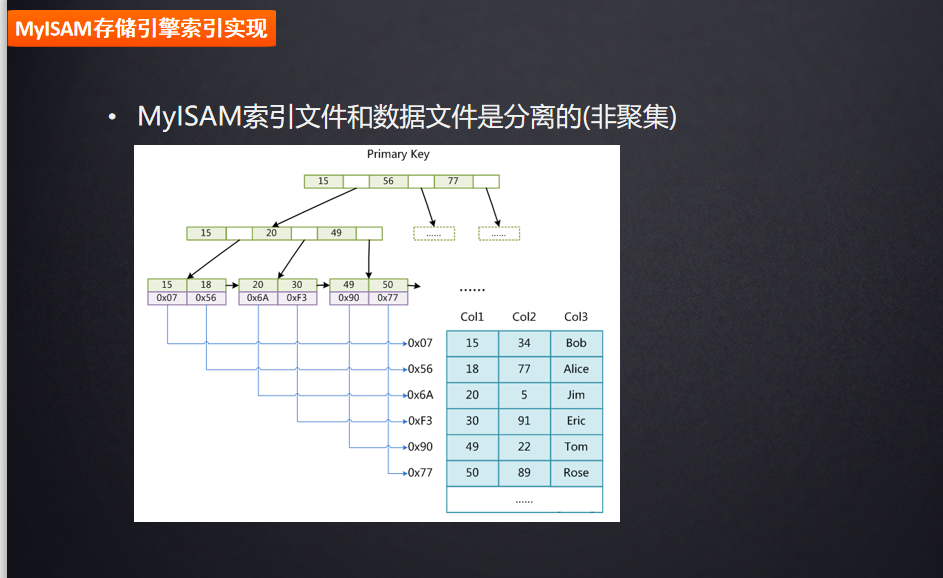
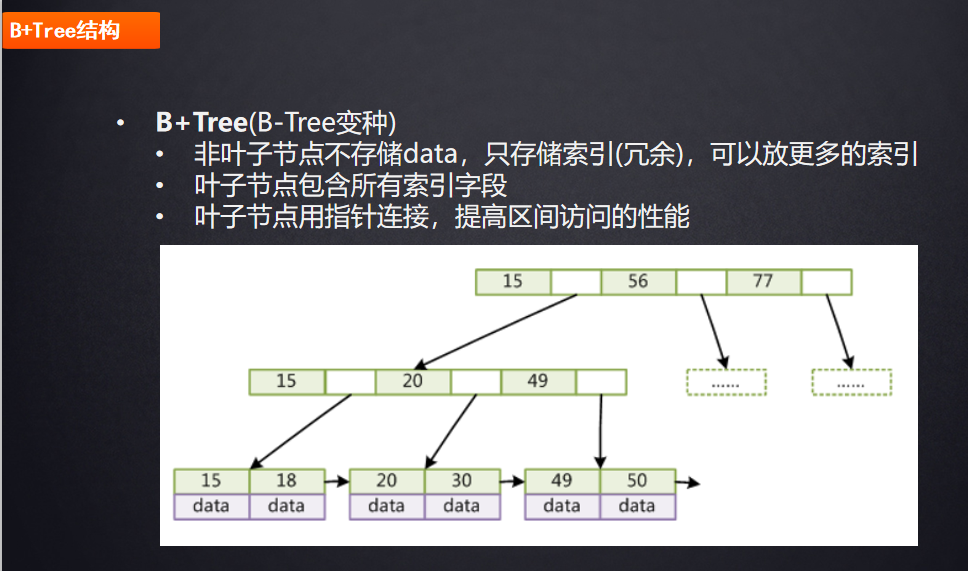
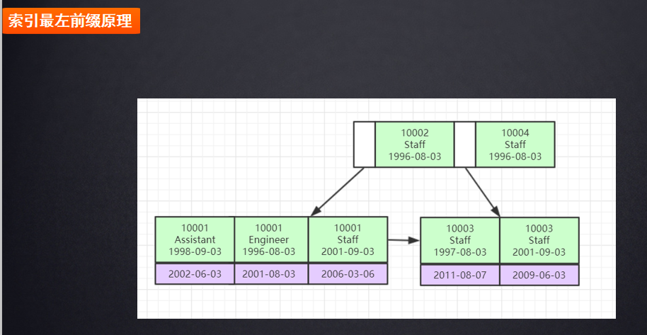

# 一、Mysql索引数据结构
（https://www.cs.usfca.edu/~galles/visualization/Algorithms.html 数据结构可视化）
```
1、二叉树
特点：二叉树，右边节点始终大于左边。
缺点：如果插入的数据是有序的，那么就会造成一边的节点一直增长，导致树的节点过深变成一个链表的结构，如果查找时I/O的次数也就变多

2、红黑树（平衡二叉树）
特点：如果右边的节点高度 大于2，那么就会自动将节点进行转换平衡。
缺点：如果数据过多，还是会导致树的高度不可控，查找的效率也会变低

3、Hash表
特点：经过hash运算之后，去hash表中查找到数据的指针。
缺点：如果范围查找或者模糊查询，索引就不能用

4、B-Tree
特点：一个节点存放多个索引值以及数据，两个索引值之间会存放一个指针，指向下一个节点。每个节点都会存储key和data，不同的存储引擎，data的值存储不一样，Myisam可能存储这一行数据的指针，也有可能存储剩下的其它所有列
缺点：如果data过大，就会导致一个节点存放的索引值变少，mysql默认推荐16kb

5、B+Tree
Mysql底层采用的，非叶子节点不存储数据只存索引，这样就不会因为data数据过大而导致单个节点存放的数据变少。
叶子节点包含了所有的索引字段，叶子节点用指针连接提高区间访问的性能。
计算可以存多少： 16kb/(数据类型的大小+6B的指针) * 16kb/(数据类型的大小+6B的指针) * 叶子节点存的数据；叶子节点使用指针连接的目的就是如果范围查找或者模糊查找时使用，不用返回根节点
```





# 二、存储引擎

### 1、Myisam
```
Myisam主键索引跟非主键索引底层采用B+树的结构，查找时基本相似，先将索引文件MYI加载到内存当中并且查找到对应的节点，节点中存储磁盘文件的地址。
存储三个文件:
.frm 表的结构
.MYD 表的所有数据
.MYI 表的索引字段
```

### 2、Innodb
##### Innodb索引实现（聚集）
- 表数据文件本身就是按B+Tree组织的一个索引结构文件
- 聚集索引-叶节点包含了完整的数据记录，索引跟数据文件存放在同一个文件中
```
存储文件：
.frm
.idb 存储的索引+数据

问题1：为什么InnoDB表必须有主键，并且推荐使用整型的自增主键？
    因为InnoDB使用的是B+Tree组织的索引结构文件，需要有个主键来作为根节点，如果没有创建，并且mysql没有找到唯一索引的话，后台会自动创建一个rowId。
使用整型的话，因为查找是会存在索引大小的比较，如果用uuid的话就会导致性能低下；还有如果新增节点的话使用整型之后直接往后面追加，如果是uuid那么久会存在插入的情况，如果插入的节点已经满了就会存在分列以及平衡

问题2：为什么非主键索引结构叶子节点存储的是主键值（一致性和节省存储空间）
    因为如果插入数据的时候，如果叶子节点不存主键值的话，就需要去维护主键索引表以及非主键索引表的数据，就会涉及到事务的问题，一旦有事务那么性能就降低了

聚集索引：（索引跟数据存放在一起，同一个文件中）
    叶节点存储的是所有数据
非主键索引：
    叶子节点的数据存的是主键索引，主要的目的就是节省空间以及数据一致性问题。
联合索引：
    按照建立索引的顺序进行排序。
    比如：a,b,c三个字段组成联合索引，排序的方式就是 a的值相同，那么b就会按照升序来进行排序，并且c按照b（b值相同）来进行排序；如果a不同，那么b就是无序的。
    如果索引值为null值，那么就会放在叶子节点的最前面的块中
```

### 三、索引优化
##### 1、explain介绍
```

explain select * from film where id = 1；show warnings 可以查看mysql在底层做的优化
1、id列：主要是显示sql执行的优先级，id列越大优先级越高，id相同则从上往下执行，id为null最后执行
2、select_type：表示对应的sql是复杂查询还是简单查询
3、table列：查询时用到的表
4、type列：system > const > eq_ref > ref > range > index > ALL  优化一般需要达到range级别，最好到ref
    const, system 能对查询的某部分进行优化并将其转化成一个常量，当表里只有一条数据进行匹配是一般是system
        explain extended select * from (select * from film where id = 1) tmp; 子查询用只有一条数据
    eq_ref：primary key 或 unique key 索引的所有部分被连接使用，只会查出最多一条数据时
        explain select * from film_actor left join film on film_actor.film_id = film.id;
    ref：不适用唯一索引，可能会返回多条数据
        explain select * from film where name = 'film1';
    range：范围查找
        explain select * from actor where id > 1;
    index：扫描全表索引
         explain select * from film
    ALL：全表扫描
5、possible_keys列：可能用到哪些索引
6、key列：实际用到的列，可以使用force index、ignore index来强制使用索引或者忽略
7、key_len列：具体用到索引的长度。如果时varchar类型 一般是  3n + 2 n代表设置数据类型的长度，如果字段允许为 NULL，需要1字节记录是否为 NULL
8、ref列：表查找值所用到的列或常量
9、rows列：预估要检测的行数，并不是结果集的行数
10、Extra列：
    Using index：使用覆盖索引
    Using where：查询的结果并未被列覆盖，需要回表查询
    Using index condition：查询的列不完全被索引覆盖，只覆盖了一些
    Using temporary：使用到了临时表。一般使用索引来进行优化
    Using filesort：文件排序。
        双路排序：双路排序的特点就是当结果集过大时，会一部分一部分的取到sort buffer当中，最后排序完成再通过id去表中查询出所有数据
        单路排序：一次将所有数据都取出来存到sort buffer中进行排序
        选择什么排序由mysql来进行选择，可以通过 max_length_for_sort_data 来调节sort buffer的大小
    Select tables optimized away：使用了聚合函数比如 min,max
```


##### 2、索引优化实践

```
注意：具体是否会走索引由mysql底层进行走索引时cost的成本以及全表查询时的cost，trace工具 计算sql走索引的成本，用完之后就需要关掉不然会影响性能。

sql：
    CREATE TABLE `employees` (
  `id` int NOT NULL AUTO_INCREMENT,
  `name` varchar(24) CHARACTER SET utf8 COLLATE utf8_general_ci NOT NULL DEFAULT '' COMMENT '姓名',
  `age` int NOT NULL DEFAULT '0' COMMENT '年龄',
  `position` varchar(20) CHARACTER SET utf8 COLLATE utf8_general_ci NOT NULL DEFAULT '' COMMENT '职位',
  `hire_time` timestamp NOT NULL DEFAULT CURRENT_TIMESTAMP COMMENT '入职时 间',
  PRIMARY KEY (`id`) USING BTREE,
  KEY `idx_name_age_position` (`name`,`age`,`position`) USING BTREE
) ENGINE=InnoDB AUTO_INCREMENT=7 DEFAULT CHARSET=utf8 ROW_FORMAT=COMPACT COMMENT='员工记录表';
联合索引原理：
    根据B+tree的数据结构中联合索引可以分析，mysql会对三个字段进行排序，name先排序如果name的值相同那么将age进行排序，如果age相同则对position进行排序，如果name的值不相同，那么age相对于name来说就是无序的。进行查找时会首先比较name，如果直接跳过name，mysql首先比较name发现没有那么就直接进行全表扫描了
1、全值匹配。
    EXPLAIN SELECT * FROM employees WHERE name= 'LiLei';
    EXPLAIN SELECT * FROM employees WHERE name= 'LiLei' AND age = 22;
    EXPLAIN SELECT * FROM employees WHERE name= 'LiLei' AND age = 22 AND position ='manager';
2、最左前缀法则：
    EXPLAIN SELECT * FROM employees WHERE age = 22 AND position ='manager';
    EXPLAIN SELECT * FROM employees WHERE position = 'manager'; 
    EXPLAIN SELECT * FROM employees WHERE name = 'LiLei';
3、不要在索引列上做任何操作转换（计算、函数、（自动or手动）类型转换）
    EXPLAIN SELECT * FROM employees WHERE name = 'LiLei'; 
    EXPLAIN SELECT * FROM employees WHERE left(name,3) = 'LiLei'; //截取左边的3为，截取后跟索引字段都不一样了，就没有什么意义了
    EXPLAIN select * from employees where date(hire_time) ='2018-09-30'; //可以优化成 select * from employees where hire_time >='2018-09-30 00:00:00' and hire_time <='2018-09-30 23:59:59'; 并且加上索引

4、联合索引中范围条件右边的列
    EXPLAIN SELECT * FROM employees WHERE name= 'LiLei' AND age > 22 AND position ='manager'; //根据联合索引的数据结构会发现，name的值是已经固定的，而age是范围查找，那么age相对于name来说顺序是进行排序了的，索引能够用到name和age，
    但是position相对于age来说，因为age是范围的所以position就是无序的，所以就用不到position的索引
5、尽量使用覆盖索引（只访问索引的查询（索引列包含查询列）），减少select *语句
6、mysql在使用不等于（！=或者<>）的时候无法使用索引会导致全表扫描
    EXPLAIN SELECT * FROM employees WHERE name != 'LiLei' （8.0的版本可以走）; // 不等于 也是相当于范围查找
7、is null,is not null 也无法使用索引。每一个节点都会去进行对比，相当于也是走全表扫描了
8、like以通配符开头（'%abc...'）mysql索引失效会变成全表扫描操作。
    问题：为什么左%失效 右%不失效。因为mysql对比字段是每一字段从左到右每个字符挨个进行对比，比如 name = 'abc'如果是'%Lei'，mysql一进来发现左边是%那么应该跟谁进行对比？所以左边就不能走索引。但如果是'Lei%'这样那么进来就可以获取L 然后挨个进行对比。
    EXPLAIN SELECT * FROM employees WHERE name like '%Lei'
    解决左模糊，可以使用覆盖索引：EXPLAIN SELECT name FROM employees WHERE name like '%Lei' 发现type为index，用到索引
9、字符串不加单引号索引失效
    如果字符串不加单引号，mysql底层会进行数据类型的转换，一旦转换了就跟索引没有任何关系了
10、少用or或in，用它查询时，mysql不一定使用索引，mysql内部优化器会根据检索比例来决定是否使用索引（可以弄1w条数据来验证）
    EXPLAIN SELECT * FROM employees WHERE name = 'LiLei' or name = 'HanMeimei';
11、范围查询优化
    给需要进行范围查找的创建单值索引。具体会不会走索引也是mysql优化时，判断走索引时的成本
```

##### 3、trace工具（计算mysql优化以及计算mysql走索引时的成本）
```
set session optimizer_trace="enabled=on",end_markers_in_json=on; ‐‐开启trace
select * from employees where name > 'a' order by position;
SELECT * FROM information_schema.OPTIMIZER_TRACE;

{
	"steps": [{
			"join_preparation": {
				"select#": 1,  //第一阶段：SQL准备
				"steps": [{
					"expanded_query": "/* select#1 */ select `employees`.`id` AS `id`,`employees`.`name` AS `name`,`employees`.`age` AS `age`,`employees`.`position` AS `position`,`employees`.`hire_time` AS `hire_time` from `employees` where (`employees`.`name` > 'a') order by `employees`.`position`"
				}] /* steps */
			} /* join_preparation */
		},
		{
			"join_optimization": {
				"select#": 1,   //第二阶段：SQL优化阶段
				"steps": [{
						"condition_processing": {
							"condition": "WHERE",
							"original_condition": "(`employees`.`name` > 'a')",  // 条件处理
							"steps": [{
									"transformation": "equality_propagation",
									"resulting_condition": "(`employees`.`name` > 'a')"
								},
								{
									"transformation": "constant_propagation",
									"resulting_condition": "(`employees`.`name` > 'a')"
								},
								{
									"transformation": "trivial_condition_removal",
									"resulting_condition": "(`employees`.`name` > 'a')"
								}
							] /* steps */
						} /* condition_processing */
					},
					{
						"substitute_generated_columns": {} /* substitute_generated_columns */
					},
					{
						"table_dependencies": [{  // 表依赖详情
							"table": "`employees`",
							"row_may_be_null": false,
							"map_bit": 0,
							"depends_on_map_bits": [] /* depends_on_map_bits */
						}] /* table_dependencies */
					},
					{
						"ref_optimizer_key_uses": [] /* ref_optimizer_key_uses */
					},
					{
						"rows_estimation": [{   //预估表的访问成本
							"table": "`employees`",  
							"range_analysis": {
								"table_scan": {  //全表扫描情况
									"rows": 3,  //全表扫描行数
									"cost": 2.65 //预计花费成本
								} /* table_scan */ ,
								"potential_range_indexes": [{  //查询可能使用的索引
										"index": "PRIMARY",  //主键索引
										"usable": false,
										"cause": "not_applicable"
									},
									{
										"index": "idx_name_age_position", //辅助索引
										"usable": true,
										"key_parts": [
											"name",
											"age",
											"position",
											"id"
										] /* key_parts */
									}
								] /* potential_range_indexes */ ,
								"setup_range_conditions": [] /* setup_range_conditions */ ,
								"group_index_range": {
									"chosen": false,
									"cause": "not_group_by_or_distinct"
								} /* group_index_range */ ,
								"skip_scan_range": {
									"potential_skip_scan_indexes": [{
										"index": "idx_name_age_position",
										"usable": false,
										"cause": "query_references_nonkey_column"
									}] /* potential_skip_scan_indexes */
								} /* skip_scan_range */ ,
								"analyzing_range_alternatives": {     //分析各个索引使用成本
									"range_scan_alternatives": [{
										"index": "idx_name_age_position",
										"ranges": [
											"a < name"
										] /* ranges */ ,
										"index_dives_for_eq_ranges": true,
										"rowid_ordered": false,  //使用该索引获取的记录是否按照主键排序
										"using_mrr": false,
										"index_only": false, //是否使用覆盖索引
										"rows": 3,        //索引扫描行数
										"cost": 1.31,     //索引使用成本
										"chosen": true    //是否选择该索引
									}] /* range_scan_alternatives */ ,
									"analyzing_roworder_intersect": {
										"usable": false,
										"cause": "too_few_roworder_scans"
									} /* analyzing_roworder_intersect */
								} /* analyzing_range_alternatives */ ,
								"chosen_range_access_summary": {
									"range_access_plan": {
										"type": "range_scan",
										"index": "idx_name_age_position",
										"rows": 3,
										"ranges": [
											"a < name"
										] /* ranges */
									} /* range_access_plan */ ,
									"rows_for_plan": 3,
									"cost_for_plan": 1.31,
									"chosen": true
								} /* chosen_range_access_summary */
							} /* range_analysis */
						}] /* rows_estimation */
					},
					{
						"considered_execution_plans": [{
							"plan_prefix": [] /* plan_prefix */ ,
							"table": "`employees`",
							"best_access_path": {  // 最优访问路径
								"considered_access_paths": [{  //最终选择的访问路径
									"rows_to_scan": 3,
									"access_type": "range",  // 访问类型：为scan，全表扫描，range，范围查找
									"range_details": {
										"used_index": "idx_name_age_position"
									} /* range_details */ ,
									"resulting_rows": 3,
									"cost": 1.61,
									"chosen": true,   // 确定选择
									"use_tmp_table": true
								}] /* considered_access_paths */
							} /* best_access_path */ ,
							"condition_filtering_pct": 100,
							"rows_for_plan": 3,
							"cost_for_plan": 1.61,
							"sort_cost": 3,
							"new_cost_for_plan": 4.61,
							"chosen": true
						}] /* considered_execution_plans */
					} /* join_optimization */
		},
		{
			"join_execution": {  // 第三阶段：SQL执行阶段
				"select#": 1,
				"steps": [{
					"sorting_table": "employees",
					"filesort_information": [{
						"direction": "asc",
						"expression": "`employees`.`position`"
					}] /* filesort_information */ ,
					"filesort_priority_queue_optimization": {
						"usable": false,
						"cause": "not applicable (no LIMIT)"
					} /* filesort_priority_queue_optimization */ ,
					"filesort_execution": [] /* filesort_execution */ ,
					"filesort_summary": {
						"memory_available": 262144,
						"key_size": 40,
						"row_size": 190,
						"max_rows_per_buffer": 1024,
						"num_rows_estimate": 1024,
						"num_rows_found": 3,
						"num_initial_chunks_spilled_to_disk": 0,
						"peak_memory_used": 32800,
						"sort_algorithm": "std::sort",
						"sort_mode": "<fixed_sort_key, packed_additional_fields>"
					} /* filesort_summary */
				}] /* steps */
			} /* join_execution */
		}
	] /* steps */
}
结论：全表扫描的成本高于索引扫描，所以mysql最终选择索引扫描
```
##### 4、order by和group by优化
```
1、explain SELECT * from employees where name = 'LiLei' and position = 'dev' ORDER BY age desc
分析：用到了name 中间断了position没有用到 但是排序时用的age因为name用到了 所以排序中没有using filesort

2、explain SELECT * from employees where name = 'LiLei' ORDER BY position desc
分析：中间断了age 所以用到了文件排序using filesort

3、explain SELECT * from employees where name = 'LiLei' ORDER BY position,age desc
分析：最佳左前缀，position和age换了位置用到了文件排序。为什么mysql优化器不优化呢？如果mysql优化了位置，那么排序的结果就不一样了

4、explain SELECT * from employees where name in ('LiLei','zhuge') ORDER BY age,position
分析：出现了using filesort，因为name是范围查找所以相对于age来说还是需要进行排序，所以用到了using filesort

group by与order by很类似，其实质是先排序后分组，遵照索引创建顺序的最左前缀法则。对于group by的优化如果不需要排序的可以加上order by null禁止排序。注意，where高于having，能写在where中 的限定条件就不要去having限定了。
```

##### 5、limit优化
```
1、根据自增且连续的主键排序的分页查询
    select * from employees limit 90000,5; 没有用到索引，执行过程是查询出90005条数据，然后丢弃掉前面的90000
    优化：select * from employees where id > 90000 limit 5; 用到了索引，效率高出第一条。但是如果id中有空缺的 就会导致数据不一致。只能用在主键连续的情况下
    
2、按照非主键字段进行排序
    select * from employees ORDER BY name limit 90000,5;   //key值是为null，因为mysql优化时计算成本发现走索引比没有走索引成本还高，所以就没有用到索引，并且还用到了文件排序
    可以先使用索引覆盖，将id查出来，并且使用内连接这样查出来，会发现都走了索引
    优化：explain SELECT * from employees m inner JOIN (select id from employees ORDER BY name limit 90000,5) t on m.id = t.id  
```
##### 6、关联表优化
###### 1、常用算法
- Nested-Loop Join NLJ算法 （索引算法）
- Block Nested-Loop Join BNL算法 （未走索引算法）

```
CREATE TABLE `t1` (
	`id` INT ( 11 ) NOT NULL AUTO_INCREMENT,
	`a` INT ( 11 ) DEFAULT NULL,
	`b` INT ( 11 ) DEFAULT NULL,
	PRIMARY KEY ( `id` ),
	KEY `idx_a` ( `a` ) 
) ENGINE = INNODB AUTO_INCREMENT = 10001 DEFAULT CHARSET = utf8;
CREATE TABLE t2 LIKE t1;

驱动表（小表）：一次一行循环的从表中取出数据，然后在从这行数据里面取出关联字段，根据关联的字段在另外一张表（被驱动表）里面取出满足条件的行，然后取出结果的合集
1、EXPLAIN select*from t1 inner join t2 on t1.a= t2.a;
id一样从向往下执行，所以t2是驱动表，所以排在前面不一定就是驱动表，mysql会优先选择数据量小的来作为驱动表。如果Extra里面没有Using join buffer，那么就使用了NLJ算法
sql执行的流程：
    a、先t2中取出一行数据
    b、取出t1中满足关联字段的数据
    c、取出t1和t2中满足条件的数据合并，并返回客户端
    d、重复上面的三部
    整个过程 t2会扫秒100次，t1扫描索引可以认为每次只扫描最多1行数据，所以t1也只扫描100次。如果没有索引使用NLJ算法性能会有所下降，Mysql会选择BNL算法

2、EXPLAIN select*from t1 inner join t2 on t1.b= t2.b    //去掉关联字段的索引
Extra 中 的Using join buffer (Block Nested Loop)说明该关联查询使用的是 BNL 算法。
sql执行的流程：
    a、会把驱动表中的所有数据放进join_buffer中
    b、把被驱动表中数据一行一行的取出来跟join_buffer中做对比
    c、返回满足条件的数据
    整个过程，t1和t2都做了全表扫描，因此扫描的总数为t1的总数+t2的总数。并且join_buffer中的数据是无序的，因此对表t1表中的每一行都要做对比就是100*10000=100w次，内存要对比100w次

被驱动表的关联字段没索引为什么要选择使用 BNL 算法而不使用 Nested-Loop Join 呢？
因为NLJ算法采用的循环遍历，几乎被驱动表每次都要执行全表扫描，如果没有索引的话那么扫描次数会相当多，开销会非常大。而且有索引的话，因为索引是排好序的所以直接能够获取到数据，直接免去了数据的对比
BNL和NLJ相比较：BNL加入了Join_buffer缓冲区，会把驱动表所有数据都放到join_buffer中，用BNL磁盘扫描次数少很多，相比于磁盘扫描，BNL的内存计算会快得多。 因此MySQL对于被驱动表的关联字段没索引的关联查询，一般都会使用 BNL 算法。如果有索引一般选择 NLJ 算法，有索引的情况下 NLJ 算法比 BNL算法性能更高

关联sql优化：
1、关联字段加索引
2、小表驱动大表。写sql时如果明确知道哪张表的数据比较少可以使用straight_join写法固定驱动方式，免去mysql优化器自己判断的时间
straight_join：只使用inner join 因为left join等已经指定了驱动方式
```

##### 7、in和exsits优化
###### 原则：小表驱动大表，即小的数据集驱动大的数据集
```
1、当A表大于B时 in优于exsits
select * from A where id in (select id from B) 2 等价于： for(select id from B){ 4 select * from A where A.id = B.id }

2、当A表小于B时 exsits优于in

EXISTS子查询往往也可以用JOIN来代替，何种最优需要具体问题具体分析
```

##### 8、count(*)查询优化
```
先关闭查询缓存：
set global query_cache_size=0;
set global query_cache_type=0;
EXPLAIN select count(1) from employees;
EXPLAIN select count(id) from employees;
EXPLAIN select count(name) from employees;
EXPLAIN select count(*) from employees;
执行计划都差不多一样
为什么mysql最终选择辅助索引而不是主键聚集索引？  因为二级索引相对主键索引存储数据更少，检索性能应该更高

常用优化方法：
对于myisam存储引擎的表做不带where条件的count查询性能是很高的，因为myisam存储引擎的表的总行数会被。原因：myisam不支持事务，所以不会存在数据回滚的问题
1、查询mysql自己维护的总行数
2、show table status; 只能获取行的估计值
3、将总数维护到redis中，但是会出现事务的问题
4、增加计数表，维护在同一个事务中
```